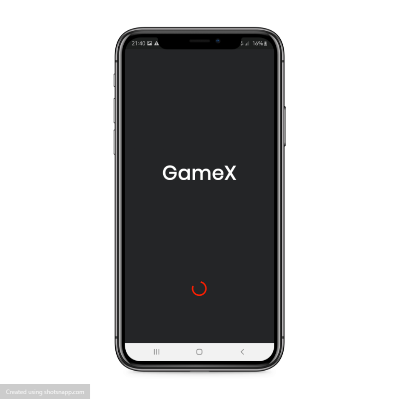
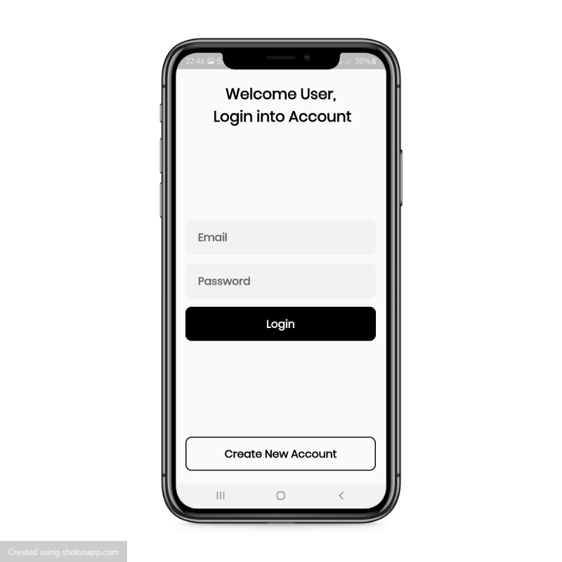
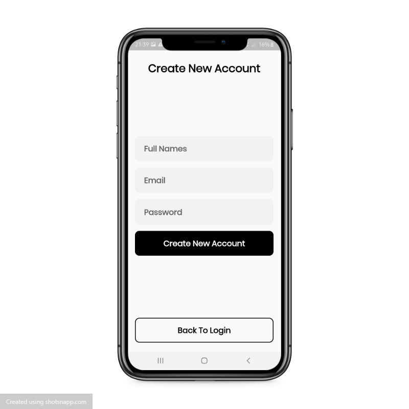
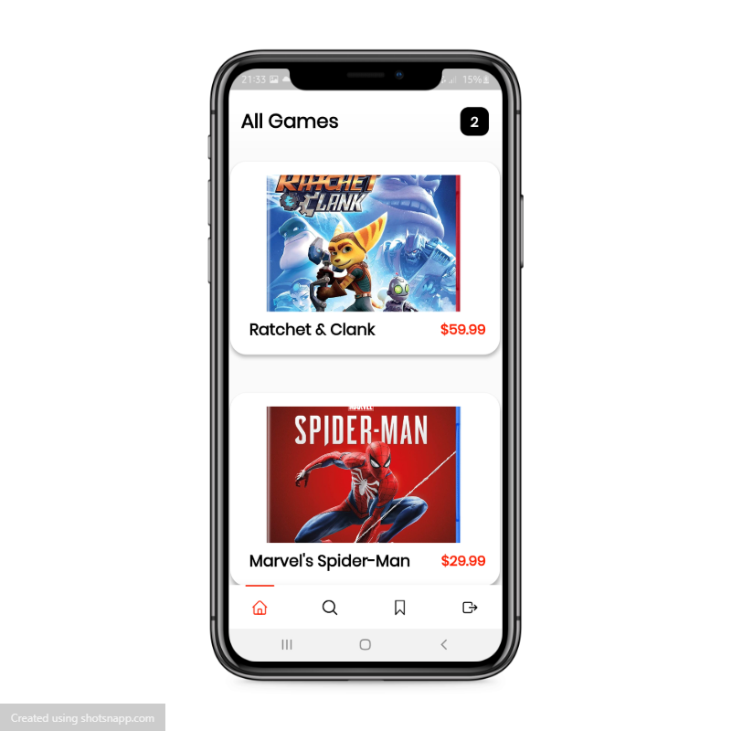
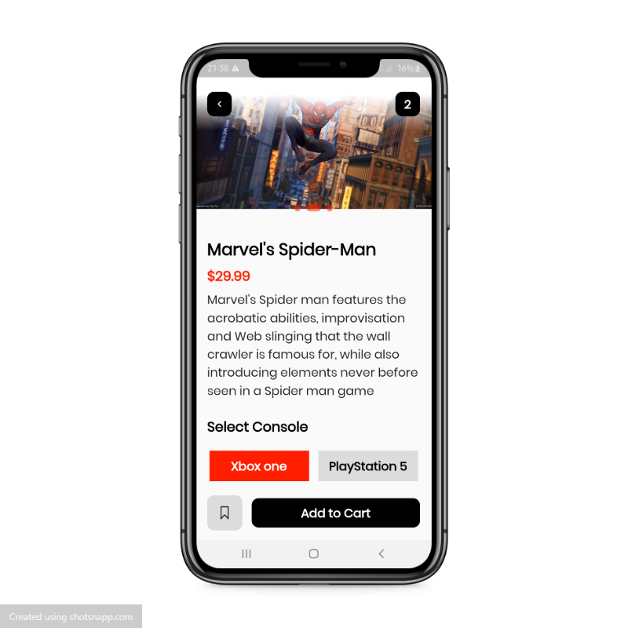
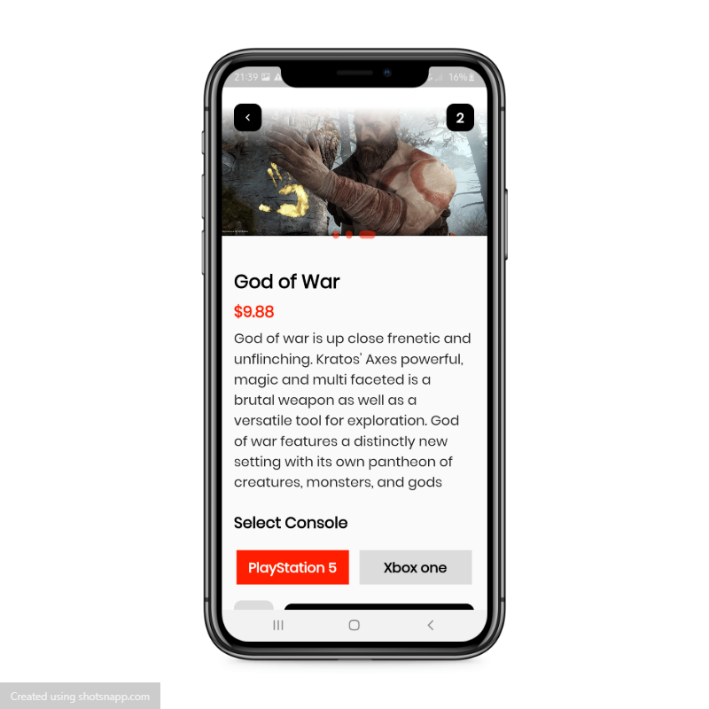
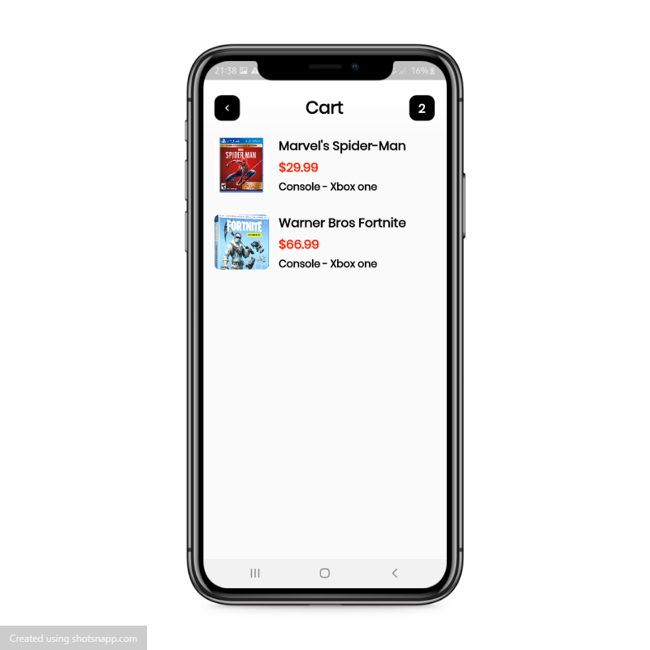

# GameX - Flutter Application
🚧 Work In Progress 🚧

 GameX App is an android application that enables gamers find the best gaming deals. [GameX]("https://github.com/MartinMugambi/GameX") alllows gamers to shop for their various games online based on their current gaming console.  The application has been engineered using Firebase as the database.
 
 I created this repository for a few reasons:
 1. To learn the approch of implementing clean architecture and [SOLID principles](https://en.wikipedia.org/wiki/SOLID#:~:text=The%20SOLID%20concepts%20are%3A,%2C%20but%20closed%20for%20modification.%22) in an android app.
 2. To learn libraries/tools supported by Google and most of the android development communities.
 3. To experiment with Firebase as a database.
 4. To learn implementation of Picture-in-Picture.
 5. Demonstrate best developement practices by utilizing up to date tech-stack .

 ## Table of Contents

- [Prerequisite](#prerequisite)
- [Plugins](#plugins)
- [Related Posts](#related-posts)
- [Screenshots](#screenshots)

## Prerequisite.
- In order to run the application, you need to [clone]("link_to_clone)/[fork]("link_to_fork) the [Gamex Project]("https://github.com/MartinMugambi/GameX").

- Download the [Flutter Programming Language SDK]("https://flutter.dev/?gclsrc=ds&gclsrc=ds) in your computer.

- Download VS code or Android studio code editor and intregrate the flutter sdk with the code editor

## Plugins.

 1. Firebase_core -A Flutter plugin to use the Firebase Core API, which enables connecting to multiple Firebase apps.
 
 3. Firebase_auth - Flutter plugin for Firebase Auth, enabling Android and iOS authentication using passwords, phone numbers and identity providers like Google, Facebook and Twitter.
 
 5. Cloud_firestore - Flutter plugin for Cloud Firestore, a cloud-hosted, noSQL database with live synchronization and offline support on Android and iOS.

 7. Google_fonts - A package to include fonts from fonts.google.com in your Flutter app.
 
 9. Cached_network_image - Flutter library to load and cache network images. Can also be used with placeholder and error widgets.
 
 ## Related Posts.
 
 ## Screenshots.

   
        

